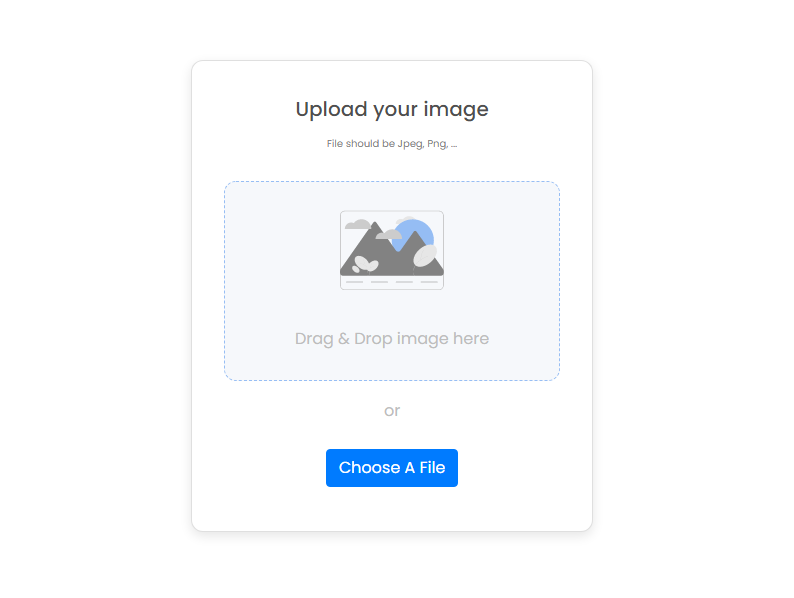

<h1 align="center">Image Uploader</h1>

<div align="center">
   Solution for a challenge from  <a href="http://devchallenges.io" target="_blank">Devchallenges.io</a>.
</div>

<div align="center">
  <h3>
    <a href="https://sn-image-uploader.herokuapp.com/">
      Demo
    </a>
    <span> | </span>
    <a href="https://github.com/srikant-n/image-uploader">
      Solution
    </a>
    <span> | </span>
    <a href="https://devchallenges.io/challenges/O2iGT9yBd6xZBrOcVirx">
      Challenge
    </a>
  </h3>
</div>

<!-- TABLE OF CONTENTS -->

## Table of Contents

- [Overview](#overview)
  - [Basic Flow](#basic-flow)
  - [Built With](#built-with)
  - [Tested With](#tested-with)
- [Features](#features)
- [How to use](#how-to-use)
- [Contact](#contact)
- [Acknowledgements](#acknowledgements)
    - [Packages](#packages)
    - [Others](#others)

<!-- OVERVIEW -->

## Overview



[Demo Link](https://sn-image-uploader.herokuapp.com/)

This was the first full stack web app that I had worked on. It appeared to be pretty easy at first but figuring out drag & drop implementation wasn't that straightforward. Testing the application was quiet tricky as well due to the changing views.

### Basic Flow
- Drag and drop or select image to upload.
- Display progress while uploading.
- Display image once upload is done.

### Built With

- [React](https://reactjs.org/)
- [Bootstrap](https://getbootstrap.com/)
- [Sass](https://sass-lang.com/)
- [Express](https://expressjs.com/)

### Tested With

- [Jest](https://jestjs.io/)
- [React Testing Library](https://testing-library.com/docs/react-testing-library/intro/)
- [Cypress](https://www.cypress.io/)

## Features

- Upload an image that can be temporarily shared over the internet using the generated url.
- Option to copy url by clicking a button.
- This application/site was created as a submission to a [DevChallenges](https://devchallenges.io/challenges) challenge. The [challenge](https://devchallenges.io/challenges/O2iGT9yBd6xZBrOcVirx) was to build an application to complete the given user stories.

## How To Use

To clone and run this application, you'll need [Git](https://git-scm.com) and [Node.js](https://nodejs.org/en/download/) (which comes with [npm](http://npmjs.com)) installed on your computer. From your command line:

```bash
# Clone this repository
$ git clone https://github.com/srikant-n/image-uploader

# Install dependencies
$ npm install

# Run the app
$ npm start
```

## Acknowledgements


### Packages
- [Multer](https://www.npmjs.com/package/multer)
- [find-remove](https://www.npmjs.com/package/find-remove)
- [cors](https://www.npmjs.com/package/cors)
- [compression](https://www.npmjs.com/package/compression)
- [Helmet](https://www.npmjs.com/package/helmet)
- [cypress-file-upload](https://www.npmjs.com/package/cypress-file-upload)

### Others
- [Setting up a Node.js Express server for React](https://medium.com/@maison.moa/setting-up-an-express-backend-server-for-create-react-app-bc7620b20a61)
- [Heroku](https://www.heroku.com/)
- [Node.js](https://nodejs.org/)
- [Markdown Live Preview](markdownlivepreview)

## Contact

- GitHub [@srikant-n](https://github.com/srikant-n)
